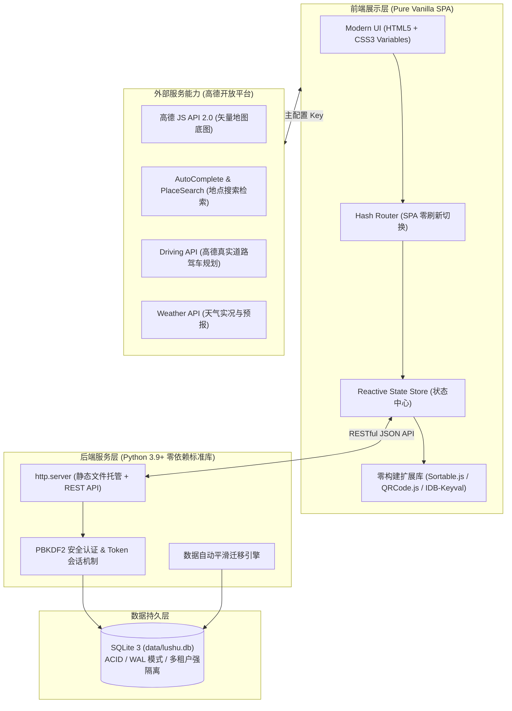

<div align="center">


# 🚗 路书 (LuShu)

**专为自驾旅行者量身打造的私有化、轻量级智能行程规划与电子路书 Web 系统**

[](LICENSE)
[](https://www.python.org/)
[](https://www.docker.com/)
[](https://www.sqlite.org/)
[](https://developer.mozilla.org/)
[](https://lbs.amap.com/)

[功能特性](#-功能特性) • [快速开始](#-快速开始) • [部署指南](#-部署指南) • [技术架构](#-技术架构) • [高德配置](#-高德-api-配置指引) • [常见问题](#-常见问题-faq)

</div>

---

## 📖 项目简介

**路书 (LuShu)** 是一款现代化的自驾旅行规划与电子路书制作工具。无论是一场周末短途自驾，还是跨越数千公里的长途探险，路书都能帮你告别传统记事本、Excel 表格或冗杂的商业旅行软件，提供**纯粹、高效、兼具空间地理感知**的沉浸式规划体验。

### 💡 为什么选择路书？

| 痛点场景 | 传统方式（Excel / 备忘录 / 商业旅行 App） | 使用「路书」 |
|:---|:---|:---|
| **地理空间感** | 纯文字记录，不知道景点之间实际距离，常常走冤枉路 | **全流程地图联动**，点击即在地图落点，实时绘制实际驾车行车轨迹 |
| **路线优化** | 手动查地图排顺序，费时费力且容易折返跑 | ⚡ **一键智能 2-opt 算法拓扑排序**，自动计算最优就近路线，消除回头路 |
| **自驾逻辑** | 每天行程起点混乱，次日出发地需重新手动设置 | 🏨 **「今晚住宿」锚点机制**，当晚住宿自动作为次日早晨的出发起点 |
| **车机/手机实操** | 只能对着文字截图或手动在导航软件里一个个输地点 | 📱 **智能拆段二维码**，突破高德官方单次导航限制，手机扫码一键直达高德 App 真实导航 |
| **数据与隐私** | 数据被商业平台存储与分析，充斥推销与广告 | 🛡️ **100% 数据私有化**，单文件 SQLite 本地落盘，零追踪、零推销、零广告 |
| **运行与维护** | 庞大的全栈依赖，npm build 耗时耗电，云端部署繁琐 | 🚀 **零构建依赖（原生 ESM）+ 零 pip 依赖（纯 Python 标准库）**，启动仅需 1 秒，内存占用 < 30MB |

---

## ✨ 功能特性

### 1. 🏠 首页工作台 (Dashboard)
- **路书卡片墙**：全览所有规划中的行程，清晰展示出行名称、起点 ➔ 终点、天数、已排地点数及最近修改时间。
- **便捷管理**：支持一键新建路书、重命名、删除以及单份路书导出为独立 JSON 文件。

### 2. 🗺️ 地图选点与灵感收集 (POI Picker)
- **智能联想检索**：高德 POI 智能搜索（AutoComplete + PlaceSearch），毫秒级防抖联想，支持键盘光标快速选点。
- **地图直观点选**：在地图上任意点击或点击高德已有地标，即可一键查看信息窗体并加入收藏。
- **防重复入库**：已收藏地点自动提示“已在信息库”，一键快速跳转定位并高亮。
- **智能当前定位**：页面加载自动获取当前真实地理位置并居中地图，出游在外随时收集周边兴趣点。
- **快捷会话撤销**：记录本次选点操作历史，支持误入库一键撤销。

### 3. 📚 收藏地点 / 资产库 (Places Archive)
- **全路书共享资产库**：一次收集，所有自驾行程均可自由调用。
- **自定义一级大类**：内置美食、酒店、游玩等分组，支持自主新建与重命名（8字限制，输入校验）。
- **现代悬停切换 UI (Hover Swap)**：常规状态显示条目计数，鼠标悬停平滑替换为操作按钮，保证类目名称单行舒展不折行。
- **自定义多维二级标签**：支持为地点打上多个标签（如“川菜”、“亲子”、“人均100”），支持多标签叠加即时筛选。
- **级联引用安全防护**：删除地点时，自动检测被哪些路书的哪一天引用，弹窗详尽提醒，防止误删破坏既有行程。

### 4. 📅 经典三栏路线规划 (Itinerary Planner)
- **左栏 · 行程排期时间轴**：
  - 按天（D1、D2...）组织日程，灵活指定出行日期；
  - 基于 SortableJS 的流畅拖拽体验，支持**同天内拖动排序**与**跨天自由穿梭拖放**；
  - 🏨 **今晚住宿锚点**：指定每晚入住酒店，系统自动将其设为次日出发的起点锚点；
  - ⚡ **一键智能就近排序**：基于 2-opt 启发式 TSP 算法，固定早晨出发与今晚住宿两端，自动计算中间景点的最短驾车顺路排列。
- **右上 · 地点素材调用池**：
  - 快速按大类、标签、关键词筛选已收藏的地点；
  - 支持直接拖拽至左侧任意一天的任意位置，或点击 ⊕ 一键追加到当前激活天末尾。
- **右下 · 地图动态实时联动**：
  - 点击左栏或右上的任意地点，地图平滑居中并弹出气泡；
  - 一键开启「显示当天连线」，实时预览当天景点的行车走线。

### 5. 🚗 电子路书生成与实车导航 (Guidebook & Navigation)
- **高德真实驾车路线渲染**：调用高德 Driving API，按天分色分段渲染高德真实道路规划线，直观呈现每段路程距离与预估耗时。
- **精美折叠行程单**：只读模式防误触，清晰展示每日行程汇总、住宿卡片及途经地点链条。
- **目的地天气预报集成**：自动解析每日目的地，集成目的地实时气温、天气与多日预报。
- **📱 智能二维码分段导航**：
  - 破解高德地图官方 URI API 单条链接最多仅支持“起点 + 1个途经点 + 终点”的限制；
  - 算法自动将每日长路线智能拆解为若干合法导航分段，动态生成二维码（QRCode.js）；
  - 手机扫码即可直接唤起高德地图 App，无缝衔接车机 CarPlay 或车载支架开始导航。

### 6. 👥 多租户支持与数据安全
- **多用户体系**：支持手机号与密码独立注册与登录，会话持久化保持 30 天。
- **数据物理强隔离**：高德 API Key、天气 Key、收藏地点、所有路书均在 SQLite 数据库层按 `user_id` 强隔离，各用户互不干扰。
- **加盐哈希加密**：采用行业标准 PBKDF2-HMAC-SHA256 算法加密存储密码。
- **平滑无缝认领**：首位注册用户自动认领历史单机遗留的本地 JSON 离线数据，升级不丢数据。

### 7. 📱 移动端与多设备适配
- 响应式自适应布局：PC 宽屏呈现专业级三栏/两栏工作台；手机及平板浏览器自动切换为纵向流式卡片。
- 触屏长按（200ms）触发拖拽排序，手机上也能顺畅微调行程。

---

## 🛠️ 技术架构



### 技术栈选型亮点

* **纯原生前端（No Build Tools）**：采用标准原生 ES Modules，无需 Node.js、Webpack、Vite 或 npm install。代码即改即看，调试直观。
* **极简自研后端（Zero pip Dependencies）**：服务端仅使用 Python 3.9+ 内置模块（`http.server`、`sqlite3`、`hashlib`、`secrets` 等），无需执行任何 `pip install`，彻底消除依赖地狱。
* **轻量级持久化**：采用单文件 SQLite 数据库（`data/lushu.db`），支持高并发 WAL 模式，备份只需拷贝一个文件，天然跨平台。

---

## 🚀 快速开始

### 方式一：Docker 一键部署（最推荐）

适合群晖 NAS、飞牛 fnOS、威联通 QNAP、1Panel、宝塔面板或各类 Linux 云服务器。

1. **克隆或下载本项目**：
   ```bash
   git clone https://github.com/your-username/lushu.git
   cd lushu
   ```

2. **使用 Docker Compose 启动**：
   ```bash
   docker compose up -d --build
   ```

3. **访问服务**：
   在浏览器中打开：`http://服务器IP:8123`
   *注：数据持久保存在项目目录的 `data/lushu.db` 中。*

---

### 方式二：本地双击启动（macOS）

1. 双击项目根目录下的 **`启动路书.command`**；
2. 系统会自动启动轻量后台常驻服务，并自动使用默认浏览器打开应用；
3. **停止服务**：双击根目录下的 **`退出路书.command`** 即可。

---

### 方式三：纯 Python 环境运行（跨平台通用）

只要你的电脑安装了 Python 3.9 或更高版本（Windows / macOS / Linux 均可）：

```bash
# 启动服务
python3 server.py

# 或者在 Linux 服务器上后台常驻运行
nohup python3 server.py > server.log 2>&1 &
```

控制台将输出类似信息，打开对应的本地域名或局域网 IP 即可访问：
```text
==================================================
  路书应用已启动 (Python 3.9+ / SQLite 模式)
  - 本地访问:  http://127.0.0.1:8123/
  - 局域网:    http://192.168.1.100:8123/
  - 数据存储:  /path/to/lushu/data/lushu.db
==================================================
```

---

## 🔑 高德 API 配置指引

为了在地图选点、渲染驾车路线与查询天气，你需要获取高德开放平台免费开发者授权（个人开发者每日有充足的免费调用额度，完全满足自驾游规划需求）：

### 1. 申请高德地图 Web 端 Key
1. 访问 [高德开放平台官网](https://lbs.amap.com/) 并登录账号（支持支付宝/手机号一键登录）；
2. 进入控制台右上角 **「应用管理」** ➔ **「我的应用」**；
3. 点击 **「创建新应用」**（例如名称填写“路书”）；
4. 在该应用下点击 **「添加 Key」**：
   - **Key 名称**：任意填写（如 `lushu-web`）；
   - **服务平台**：**务必勾选「Web端 (JS API)」**；
5. 点击提交后，你将获得：
   - **Key**（类似 `60b4a1xxxxxxxxxxxx`）；
   - **安全密钥**（类似 `b982xxxxxxxxxxxx`）。

### 2. 在路书系统中填入配置
1. 注册并登录路书系统；
2. 打开顶部导航栏右上角的 **⚙ 设置**；
3. 将复制的高德 **Key** 和 **安全密钥** 填入对应的输入框中；
4. （可选）如果你还想启用天气预报功能，可在高德控制台同样添加一个「Web服务」类型的 Key 填入“高德天气 Key”一栏；
5. 点击 **「保存设置」**，即可畅通无阻地使用所有地图与路线规划功能！

---

## 🌐 域名绑定与外网反向代理 (Nginx)

如果你部署在 VPS 或内网穿透（如 FRP、Cloudflare Tunnel、DDNS 等），建议通过 Nginx 进行反向代理并配置 HTTPS：

```nginx
server {
    listen 80;
    server_name lushu.yourdomain.com; # 你的域名

    # 客户端上传限制（全量导入备份时需要）
    client_max_body_size 50M;

    location / {
        proxy_pass http://127.0.0.1:8123;
        proxy_set_header Host $host;
        proxy_set_header X-Real-IP $remote_addr;
        proxy_set_header X-Forwarded-For $proxy_add_x_forwarded_for;
        proxy_set_header X-Forwarded-Proto $scheme;

        # WebSocket 与长连接支持
        proxy_http_version 1.1;
        proxy_set_header Upgrade $http_upgrade;
        proxy_set_header Connection "upgrade";
    }
}
```

> **📌 提示**：现代移动端浏览器（iOS Safari、Android Chrome）出于安全考量，**仅在 HTTPS 环境或 localhost 下允许网页调用 HTML5 地理定位 API**。为了在外网手机访问时能自动定位到当前位置，强烈建议配置 SSL/HTTPS 证书。

---

## 📂 项目目录结构

```text
路书 (LuShu)/
├── css/                        # 页面样式表
│   └── app.css                 # 全局设计规范、响应式布局、三栏规划器与主题变量
├── js/                         # 原生 JavaScript 模块 (ES Modules)
│   ├── core/                   # 核心逻辑
│   │   ├── amap.js             # 高德地图 SDK 加载器与定位封装
│   │   ├── api.js              # RESTful API 通讯层与 Token 处理
│   │   ├── auth.js             # 用户状态与登录/注册弹窗交互
│   │   ├── bookOps.js          # 路书数据操作集
│   │   ├── libraryOps.js       # 收藏地点/分类/标签逻辑
│   │   ├── modal.js            # 通用弹窗组件 (Confirm, FormModal)
│   │   ├── plannerOps.js       # 智能路线优化算法 (2-opt TSP) 与行程编辑
│   │   ├── state.js            # 前端统一状态中心
│   │   └── utils.js            # 工具函数 (防抖、地理距离换算、HTML转义等)
│   ├── pages/                  # 各主功能页面逻辑
│   │   ├── generate.js         # 生成路书 (驾车画线、行程单、分段二维码)
│   │   ├── home.js             # 首页工作台 (路书卡片墙)
│   │   ├── library.js          # 收藏地点 (分类标签管理、地点卡片)
│   │   ├── picker.js           # 地图选点 (POI 搜索联想、点击落点)
│   │   ├── planner.js          # 规划路线 (三栏拖拽排期工作台)
│   │   └── settings.js         # 系统设置 (Key配置、全量备份导出导入)
│   └── main.js                 # SPA 路由分发器与应用入口
├── vendor/                     # 零依赖本地第三方库 (离线运行，无需外链 CDN)
│   ├── idb-keyval.min.js       # IndexedDB 异步缓存
│   ├── qrcode.min.js           # 动态二维码生成
│   └── sortable.min.js         # 拖拽排序引擎
├── test/                       # 自动化测试套件
│   ├── test_backend.py         # 后端 API、多租户强隔离、安全防下载自动化测试 (44项)
│   └── test_migration.py       # 历史离线数据平滑迁移测试
├── data/                       # 物理数据库存储目录 (自动创建)
│   └── lushu.db                # SQLite 核心数据库文件
├── deploy/                     # 部署辅助文件 (Nginx 反代配置等)
├── Dockerfile                  # 容器化构建定义
├── docker-compose.yml          # Docker Compose 一键编排文件
├── server.py                   # 轻量 Python 后端服务 (REST API + 静态托管)
├── index.html                  # 单页应用入口 HTML
├── 启动路书.command            # macOS 双击后台启动脚本
├── 退出路书.command            # macOS 双击停止服务脚本
└── 打包部署.command            # 一键构建生产部署包脚本
```

---

## 💾 数据备份与恢复

路书的数据存储透明且极其便于备份，你拥有两种备份途径：

### 1. 物理数据库备份（最彻底）
直接将项目目录下的 `data/lushu.db` 文件复制保存到云盘、U盘或 NAS 其它备份目录即可。在需要恢复的机器上放回 `data/` 目录即可无缝还原所有用户与行程。

### 2. 界面一键导出与导入（跨环境迁移）
- **导出**：在应用右上角 **⚙ 设置** ➔ 点击 **「⬇️ 导出全部数据」**，即可将当前账号下的所有系统设置、分类、地点与全部路书打包下载为一个标准 `.json` 文件。
- **导入**：在任意新搭建的环境中，点击 **「⬆️ 导入备份」** 并选中该 `.json` 文件，系统将完成全量数据还原。

---

## ❓ 常见问题 (FAQ)

<details>
<summary><b>Q1: 为什么地图无法搜索或显示空白？</b></summary>

1. 请检查 **⚙ 设置** 中是否正确填写了高德 **Web端 (JS API)** 类型的 Key；
2. 确保在设置中同时正确填写了**安全密钥 (Security Code)**（高德 2.0 API 强制要求配置安全密钥，否则会被高德风控拦截）；
3. 打开浏览器开发者工具（F12）的 Console 控制台，查看是否有来自高德官方接口的 `INVALID_USER_KEY` 等报错。
</details>

<details>
<summary><b>Q2: Docker 构建镜像时报错 401 Unauthorized 或拉取超时？</b></summary>

部分国内 NAS（如飞牛系统）默认设置的内部镜像源可能存在权限验证异常。项目默认 `Dockerfile` 已配置兼容稳定的公开加速镜像源，你也可以在 `Dockerfile` 第一行将基础镜像更换为可访问的 Python 镜像：
```dockerfile
FROM python:3.9-slim
```
</details>

<details>
<summary><b>Q3: 外网访问时，地图无法定位到我当前的城市或位置？</b></summary>

1. 浏览器安全策略限制：在公网非 `localhost` 环境下，浏览器要求网页必须运行在 **HTTPS** 协议下才允许向网页提供精确定位权限；请为你的域名配置 HTTPS；
2. 若在 HTTP 模式下，系统已内置 IP 城市级兜底定位，确保地图能够大致居中在用户当前所在城市。
</details>

<details>
<summary><b>Q4: 手机扫码后如何直接调起高德地图 App 导航？</b></summary>

在「生成路线」页面中，每一天行程下方都会生成对应的分段二维码。使用手机相机或浏览器扫码后，会打开高德官方导航中间页，页面会自动触发唤起本机的高德地图 App；若在微信内置扫码中被拦截，只需点击微信右上角“在浏览器中打开”即可直接启动高德导航。
</details>

<details>
<summary><b>Q5: 如何修改服务默认端口？</b></summary>

- **纯 Python 模式**：通过环境变量指定端口启动，例如 `PORT=9000 python3 server.py`；
- **Docker 模式**：直接修改 `docker-compose.yml` 中的端口映射，如 `"9000:8123"`。
</details>

---

## 🤝 贡献与参与

欢迎对自驾游、路线规划与开源技术感兴趣的朋友一同完善本项目！
- 提交 Bug 或功能建议：欢迎创建 [Issues](https://github.com/your-username/lushu/issues)
- 提交代码贡献：欢迎发起 Pull Request

---

## 📄 开源协议

本项目采用 [MIT License](LICENSE) 开源协议。无论是个人自用、家庭私有部署或二次定制，均可自由使用。

---

<div align="center">
  <sub>Made with ❤️ for road-trippers and travelers. 愿每一次出发，都有清晰而美好的旅途。</sub>
</div>
